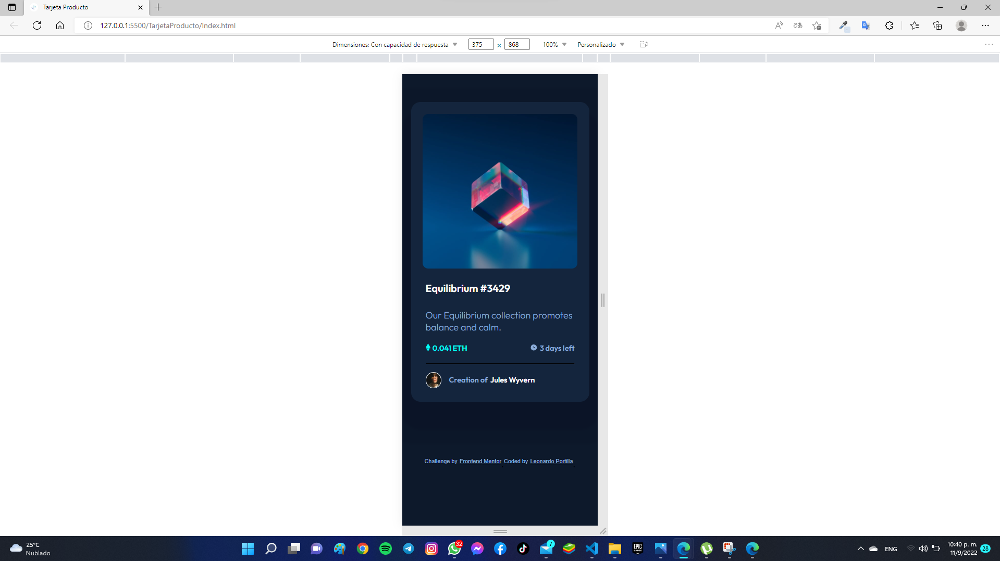
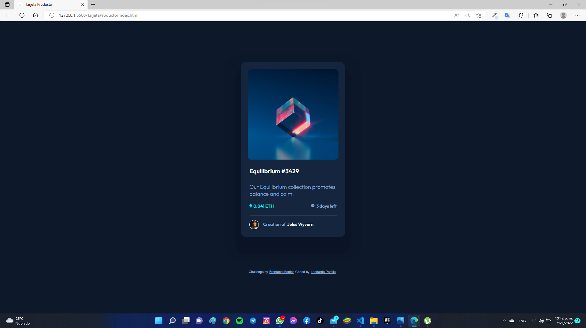

### Screenshot

### Built with

- Semantic HTML5 markup
- CSS custom properties
- Flexbox

### What I learned

Una de las parte mas complicada de este desafio fue la foto del producto y pasar con el mouse, intente de muchas manera hasta que consegui una forma que es con el background-image y la opacidad

### Continued development
Desearia seguir practicando la parte de CSS profundo, entender un poco mas sobre flex y empezar a compreder los de Grid

## Author
- Git Hud - [Leonardo Portilla](https://github.com/leooportilla)
- Frontend Mentor - [@leooportilla](https://www.frontendmentor.io/profile/leooportilla)
